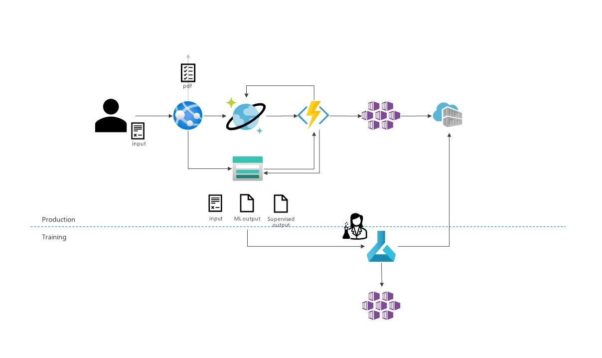

# DocumentProcessingAndML
Example implementation for E2E document processing

## Overview
In this repository, we're creating the following: 

In summary: 

- A web site, that can be used by an (interactive) user to add new documents
- A CosmosDB datastore to keep track of request/results
- Azure Functions, triggered by CosmosDB updates that will process the documents
- A (hosted) inference model, on AKS (or otherwise) to run our custom model
- A feedback loop for training data

## Solution
### ./Infrastructure 
Contains an Azure CLI script to create the infrastructure. 

    Infrastrucure scripting is kept simple/straightforward. Improvements on security and scalability can be made, e.g.: managed service identities and private networks should be added, and the ML model should be hosted on AKS instead of ACI.

### ./ML
Contains the scripts to create two (2) machine learning models, hosted via ACI. 

For each model, the following exists: 

- A notebook (*.ipynb) to create and deploy the model
- A scoring file (*.py) to handle HTTP requests and format the response
- A conda environment file (*.yml) to ensure all prerequisites are available

Adding these files to the Azure ML environment and executing the notebook should be sufficient to deploy (and test) an Azure ML endpoint. 

### ./Functions
Contains the Azure function, that will: 

- Trigger based on CosmosDB requests being created
- Download the incoming file
- Convert (via Forms Recognizer) to text
- Process via the custom model
- Upload the resulting JSON and update the CosmosDB environment

### ./Web
The web application, allowing the user to:

- Submit a new request
- Monitor (list) processing status
- Inspect the details of individual requests

## Getting started
To recreate this environment: 

- Clone this repository
- Run the [infrastructure/setup.sh](infrastructure/setup.sh) script
- Use Visual Studio
    - Update the Azure AD info in [appsettings.json](web/appsettings.json). If no application has been created, follow the instructions [here](https://docs.microsoft.com/en-us/azure/app-service/configure-authentication-provider-aad#-create-a-new-app-registration-automatically)
    - Deploy the Web App + Function App to the created infrastructure
- In Azure ML
    - Add the required files (notebook, python, conda)
    - Create compute
    - Run the notebook
- Update the ModelKey / ModelUri settings of the Azure Function. 
- Browse to the web application. 

## Going forward
The following steps are yet to be taken: 

- Supervised training result schema has yet to be defined. Should be similar to the existing schema for [ModelProcessingResult.cs](Common/Model/ModelProcessingResult.cs). 
- Deployment to AKS, benefitting from GPU. 
- Development of CI / CD pipelines, automatically deploying the application

## Known issues / alternatives
This repository is created as an inspiration / to establish clear interfaces. The solution does not handle large files within the existing timing limits (Consumption-based Azure Function has a 5 minute timeout, managed experiments on Azure ML have a 60 seconds timeout).

Instead, the function and model should be operated on provisioned compute - such as AKS - which will mitigate these limitations.

In addition, the web application can be easily written as a static (HTML + JS) web application, as opposed to requiring server-side compute. 

